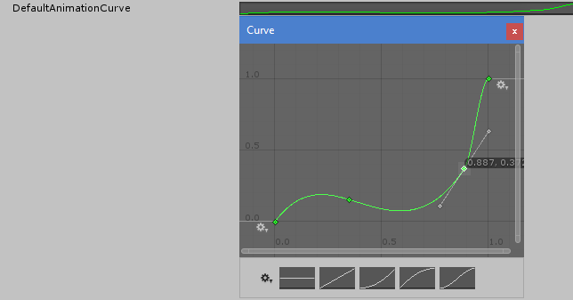
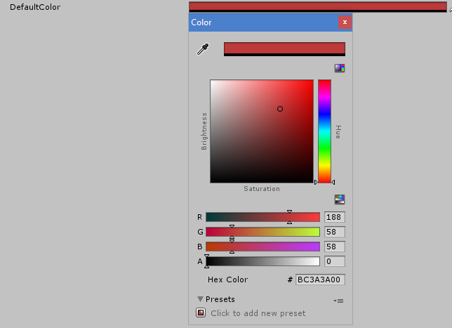

# Unity3D Inspector Reflector

<!--http://doctoc.herokuapp.com/-->
- [Introduction](#introduction)
	- [What is wrong with Unity's Inspector?](#what-is-wrong-with-unitys-default-inspector)
- [Inspection with the IR](#inspection-with-the-ir)
	- [Enabling the IR](#enabling-the-ir)
	- [Default Inspection](#default-inspection)
	- [Customized Inspection](#customized-inspection)
	- [Extensability](#extensability)

## Introduction

Writing custom Inspectors is time consuming.<br>
When a type changes its custom inspector must be modified as well.
Stop wasting that time and start to spend it on more important tasks. Not only does the IR (Inspector Reflector) save us from spending our time on non-worthy tasks but it also solves many bugs that arrose with Unity's default Inspector.

### What is wrong with Unity's default Inspector?

Unity wants us to work with their Inspector in a very specific way which is rather cumbersome and error-prone. The fact that I have abandoned many of my Unity projects left my thinking. I came to the conclusion that the default Unity Inspector doesn't allow us to write code the way we want it to be. Unity therefore prevents us from writing in a truly expressive form, making me sort of angry, and often abandoning my projects in the end.<br>
<br>
Things that make me angry:<br>
1) **The default Inspector forces us to expose fields which we often mark as private and are not meant to be part of the public contract.**<br>
   Having a non-public field and exposing it by a property is often a good choice to control the setting and retrieval of a value. To display such a non-public field in the default Inspector a workaround must be put in place that displays the field (field must be marked with <code>SerializeFieldAttribute</code>). This causes the problem that the property's getter and setter won't be called and therefore Unity's <code>OnValidate()</code> callback must be used to trigger them manually. Because we cannot tell which values have changed when <code>OnValidate()</code> is called we must validate each value and for best results only trigger the properties whose values have changed.
   
2) **There is no way to expose a property to the default Inspector.**<br>
   The solution to the problem stated in (1) would be to allow the exposure of properties to the Inspector.<br>
   At this point there is no way of doing that without having to write a full custom inspector.
   
3) **Any modification to the default Inspector forces us to write a full custom Inspector.**<br>
   Sometimes it would be beneficial to display some data in a more refined way. We may want to group some values and collapse them visually. Unity forces us to write a full custom Inspector even if we'd like to change just a small thing. A custom Inspector becomes handy if we want to completely change the appearance of the Inspector. Most of the time however we simply want to change the way a few  values are displayed and writing a full custom Inspector is definitely overkill.
   
## Inspection with the IR

The IR follows two reasonable rules at all times:
- The IR must only be allowed to display the data that can also be read through code.
- The User must only be allowed to modify data that can also be modified through code.

The IR is an opt-in feature which means that Unity still defaults to their cumbersome Inspector after the IR is added to a project - which is good. Built in types and types from third-party providers should not be targeted by the IR. However, if a third-party type was designed with the IR in mind it won't function correctly before adding the IR to the project as well. 

### Enabling the IR

In order to enable the IR in your project you simply have to copy the *InspectorReflector* directory into your *Assets* directory.
Classes marked with the <code>InspectAttribute</code> are then ready to be inspected.

```cs
[Inspect]
public class Enemy : MonoBehaviour
{
```

Such a class' public instance fields and properties can be inspected if they are also marked with the <code>InspectAttribute</code>. 

```cs
   [Inspect]
   public string Name;
   
   [Inspect]
   public int EXP
   {
      get
      {
         return _exp;
      }
      set
      {
         _exp = value;
         _level = Mathf.Floor(value / 100f);
      }
   }
   
   
   [Inspect]
   public int Level
   {
      get
      {
         return _level;
      }
   }
```

Note that the Unity Serializer is only able to serialize private fields marked with the <code>SerializeFieldAttribute</code> as well as public fields. You therefore cannot use automatically implemented properties because the invisible private backing field wouldn't be marked with the <code>SerializeFieldAttribute</code>. The solution is to create the backing field yourself like this:

```cs
   [SerializeField]
   private int _exp;

   [SerializeField]
   private int _level;
}
```

It is crucial to know that data can only survive a loading process if it can be serialized. Unity has some other restrictions on what kinds of data can be serialized. Before using the IR you should understand all those restrictions:<br>
https://blogs.unity3d.com/2014/06/24/serialization-in-unity/

### Default Inspection

By marking a public field or property with the <code>InspectAttribute</code> you tell the IR to use default inspection. By copying the *Sample* directory into your *Assets* directory you can play aroung yourself. What follows is a table to showcase the behaviour of the default inspecton on all supported types.

| Type               | Visual Result                                                    | 
|:-------------------|:-----------------------------------------------------------------|
| AnimationCurve     |    |
| bool               |                        |
| Bounds             |                    |
| Color              |                      |
| double             |                    |
| float              |                      |
| int                |                          |
| long               |                        |
| Rect               |                        |
| string             |                    |
| Vector2            |                  |
| Vector3            |                  |
| Vector4            |                  |

There are some exceptions to the behaviour explained in the table above:

| Exception          | Visual Result                                                | 
|:-------------------|:-------------------------------------------------------------|
| Readonly Property  | The value displayed when inspecting a readonly property is the <code>string</code> returned by <br>the instance's <code>ToString()</code>:<br>         |
| Enums              | Enums are displayed by a dropdown menu allowing you to choose the instance's value:<br> <br>If the enum is marked with the <code>FlagsAttribute</code> then the dropdown allows you to select multiple values:<br>                  |

### Customized Inspection

Coming soon

### Extensability

Coming soon
